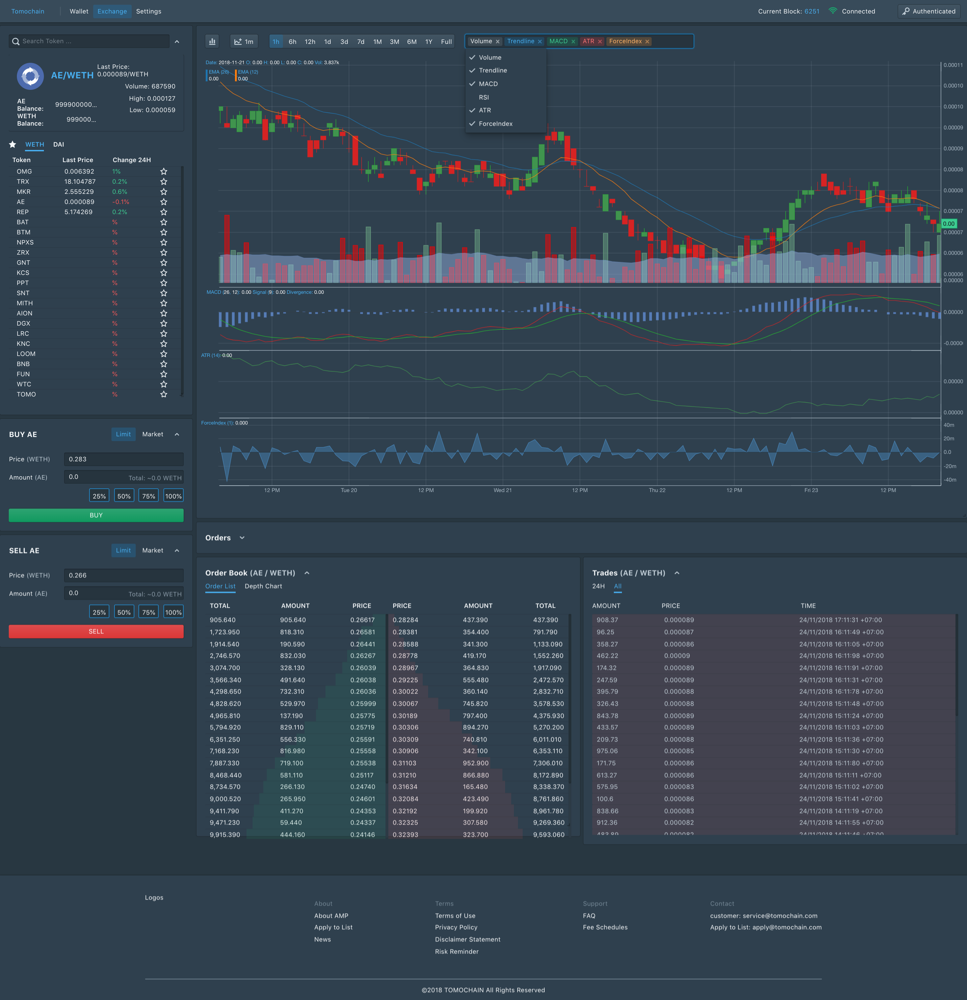

# tomo-dex-client

Official repository for the Tomochain DEX react client, forked from the Proof project.



## RLPX/SwarmFeed - Compact and secured way to store decentralized orderbook for each user.

Sample is at `src/scripts/computeFeedSignatures.js`

## Blueprint - React-based UI toolkit for the web.

It is optimized for building complex data-dense interfaces for desktop applications.

## Setup

_Goto src/scripts folder for seed-data_

```bash
# link smart-contracts into dex-contract module
$ npm link ../dex-smart-contracts
# update token from contract build folder
$ yarn query-tokens
$ yarn
$ yarn start
# run storybook
$ yarn storybook
```

## Traslations

**Extract messages**  
`yarn extract-messages`

**Update translation**
`yarn merge-translations --trim=true`

## Contributions

Please try your best to follow the guidance here:

https://chris.beams.io/posts/git-commit/
