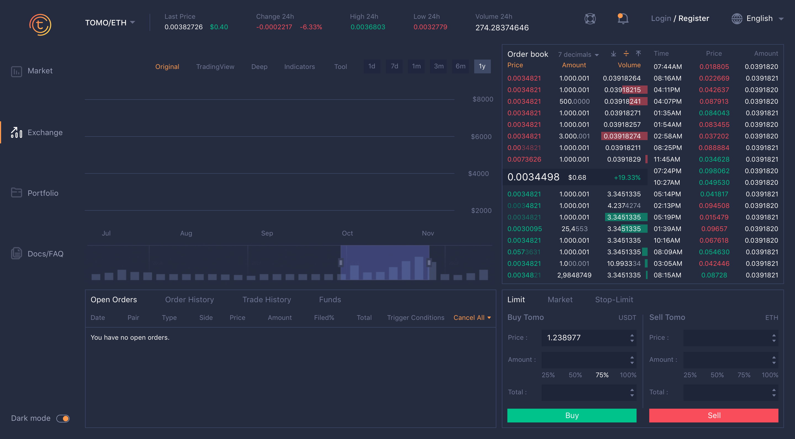
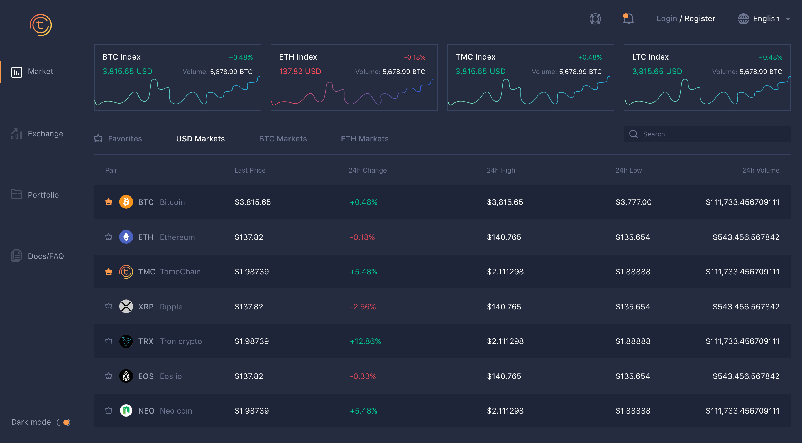

# tomo-dex-client

Official repository for the Tomochain DEX react client, forked from the Proof project.

_**Note: This project is under active development. We are using Github Issues to keep track of milestones, tasks, bugs, ....
It will be officially released when the version is v1.0.0.**_





## RLPX/SwarmFeed - Compact and secured way to store decentralized orderbook for each user.

Sample is at `src/scripts/computeFeedSignatures.js`

## Blueprint - React-based UI toolkit for the web.

It is optimized for building complex data-dense interfaces for desktop applications.

## Setup

_Goto src/scripts folder for seed-data_

```bash
# link smart-contracts into dex-contract module
$ npm link ../dex-smart-contracts
# update token from contract build folder
$ yarn query-tokens
$ yarn
$ yarn start
# run storybook
$ yarn storybook
```

## Traslations

**Extract messages**  
`yarn extract-messages`

**Update translation**
`yarn merge-translations --trim=true`

## Development Roadmap
`This part should be added in the repository of the whole DEX project (not created yet) !`

1. Authentication (support logging in by these methods):
   - [x] Private key
   - [x] Keystore / JSON File
   - [x] Mnemonic Phrase
   - [ ] Metamask
   - [x] Trezor Hardware Wallet
   - [ ] Ledger Hardware Wallet
2. Wallet Management
   - [x] Deposit TOMO
   - [x] Deposit other tokens by using TOMO currency
   - [x] Send TOMO or other tokens to other accounts
   - [ ] Add custom tokens
   - [ ] List transactions
3. Exchange
   - [x] Buy/Sell TOMO or other tokens
   - [x] Order Book
   - [x] Market Prices
   - [ ] Trades History
   - [ ] OHLCV Chart (Candlestick chart)
4. Protocol Level
   - [ ] Store order book decentralized
   - [ ] Integrate matching engine in Tomochain protocol
   - [ ] Update balance on-chain

## Contribution

Please try your best to follow the guidance here:

https://chris.beams.io/posts/git-commit/
